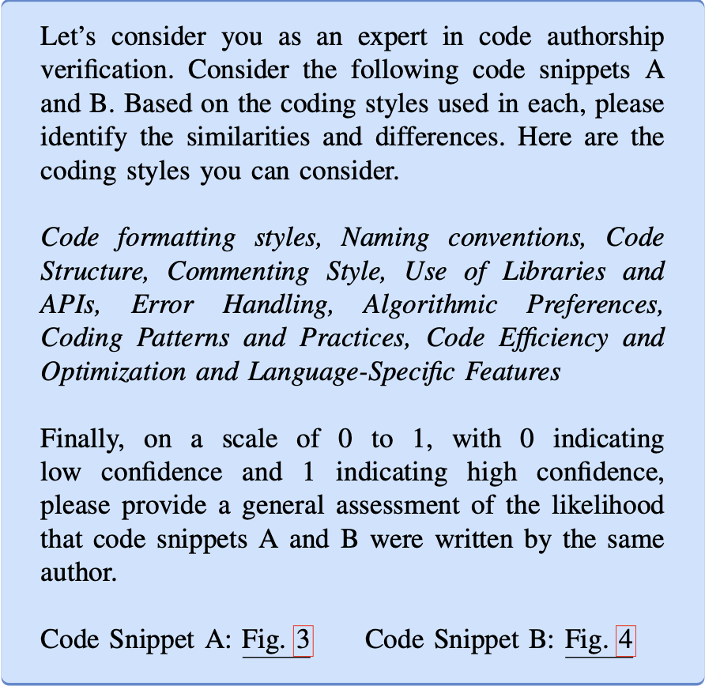

### Code Authorship Attribution:
To solve this problem using Large Language Models (LLMs), we fine-tune five encoder-only LLMsS such as `CodeBERT, ContraBERT_C, ContraBERT_G, GraphCodeBERT`, and `UnixCoder`. These models are fine-tuned on the datasets located in the `Datasets` directory.

To fine a LLM for a specific dataset, at first go to that directory. For example, I want to fine-tune `UnixCoder` for `LeetCode` dataset. To that end, I have to `cd LeetCode/UnixCoder`. Then run `python3 model.py {model_check_point} unixcoder {tokenizer_name}`. Similarly, you can fine-tune other models for different datasets. The values of `{model_check_point}` and `{tokenizer_name}` for different models are given below:

| model         | model_check_point                                                                                          | tokenizer_name                |
|---------------|------------------------------------------------------------------------------------------------------------|-------------------------------|
| CodeBERT      | microsoft/codebert-base                                                                                    | microsoft/codebert-base       |
| ContraBERT_C  | [Download and Specify path](https://drive.google.com/drive/u/1/folders/1F-yIS-f84uJhOCzvGWdMaOeRdLsVWoxN) | microsoft/codebert-base       |
| ContraBERT_G  | [Download and Specify path](https://drive.google.com/drive/u/1/folders/1t8VX6aYchpJolbH4mkhK3IQGzyHrDD3C) | microsoft/graphcodebert-base  |
| GraphCodeBERT | microsoft/graphcodebert-base                                                                               | microsoft/graphcodebert-base  |
| UnixCoder     | microsoft/unixcoder-base-nine                                                                              | microsoft/unixcoder-base-nine |

To run `SVM_Gemini` or `SVM_GPT-4`, go to `Gemini` or `GPT-4` folder. Then, run the following commands sequentially.

- `python3 embedding.py`
- `python3 find-embeddings.py`
- `python3 SVM.py`

### Code Authorship Verification:
The methodology of our code authorship verification is as follows:

`Verification` folder contains the all data and code for the all experiments we have conducted. To replicate our results, go to `Verification` directory -

- To verify code authorship using Gemini, run `python3 av_gemini.py {dataset_name} {sample}`. `{dataset_name}` should be replaced with the any of the datasets name found in `Datasets` folder. The value of `{sample}` should be `positive` or `negative`.

- Similarly, run `python3 av_gpt-4.py {dataset_name} {sample}` to verify code authorship using GPT-4.

**Note:** Before running `av_gemini.py` or `av_gpt-4.py`, please replace the respective API_Key.

### Adversarial Attack

Go to AdversarialAttack directory

### Step 1: Fine-Tuning Model
After fine-tuning UnixCoder in 9th fold, copy it in the unixcoder_fine_tuned directory

### Step 2: Generating adversarial samples
`Samples (Id-ProblemId-Lang-Author)` contains all correctly classified code snippets in 9th fold.

run `python generate-adversarial-sample.py`. It will generate adversarial samples using the transformation rules.

### Step 3: Check changes if less 50%
run `python generate-valid-sample.py`

### Step 4: Check functionality from LeetCode

run `python validate-functionality.py`

### Step 5: Attack UnixCoder

run `python attack-unixcoder.py`

