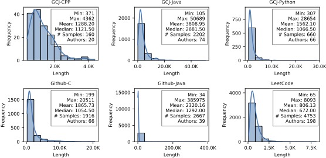
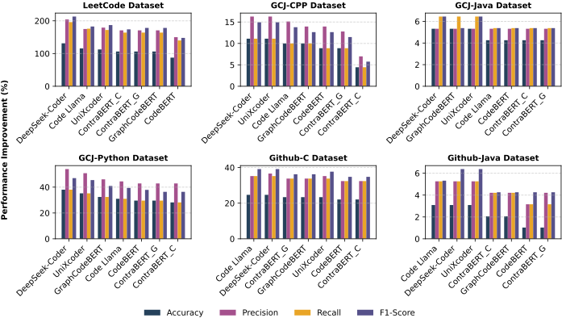
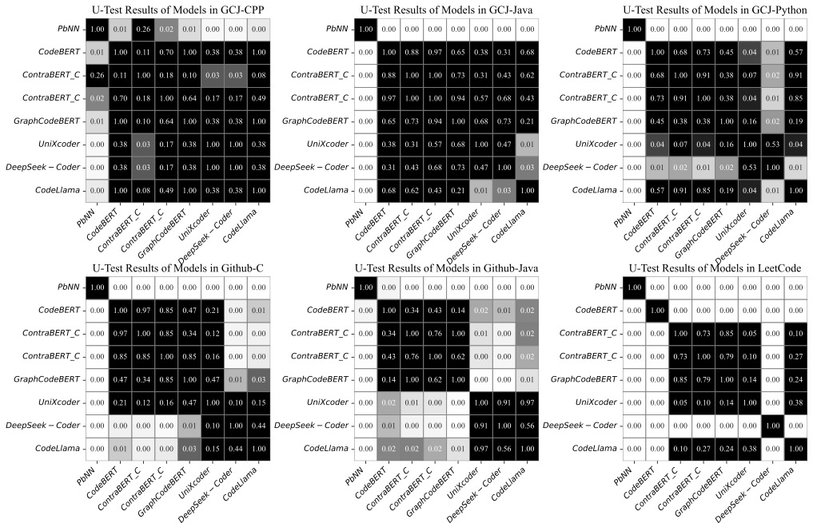
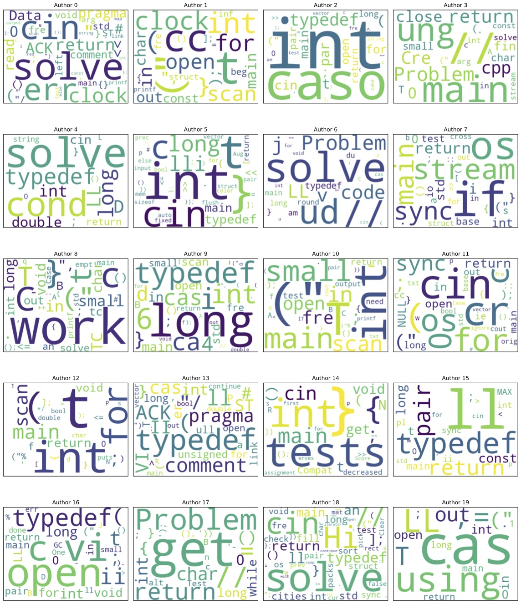
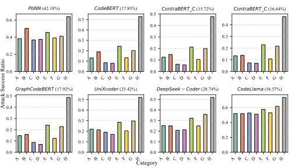
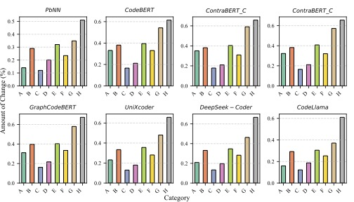

## Code Authorship Attribution (CAA) Study

This repository contains the instructions and scripts required to replicate our Code Authorship Attribution (CAA) study.

---

### Step 1: Environment Setup

All models are implemented using Python. The `requirements.txt` file contains all necessary dependencies. You need to install these dependencies in your Python environment. We recommend creating a new virtual environment before installing the dependencies.

```bash
pip install -r requirements.txt
```

---

### Step 2: Data Pre-Processing

The following folders contain the data for each dataset:

- `gcj-cpp/data`
- `gcj-cpp/java`
- `gcj-python/data`
- `LeetCode/data`
- `github-c/data`
- `github-java/data`

Inside each `data` folder, we have included the split data for different folds. These folders also contain the original dataset. However, we recommend using our splits to reproduce similar results. The split data files are named as `fold_0_train.csv`, `fold_0_test.csv`, and so on. These `.csv` files are used for fine-tuning LLMs.

For training the *PbNN* model, it is necessary to generate path contexts from the source code. Run the `generate_path_contexts.sh` script to generate path contexts. This script will generate path contexts for all datasets.

---

### Step 3: Fine-Tuning and Training

#### **Language Model (LM) Fine-Tuning**

We fine-tune CodeBERT, ContraBERT_C, ContraBERT_G, GraphCodeBERT, UniXcoder, DeepSeek-Coder and Code Llama. Among these, ContraBERT_C and ContraBERT_G are not available on [Hugging Face](https://huggingface.co). You need to download these models separately. Download instructions can be found in [ContraBERT.md](./ContraBERT.md).

The following bash scripts contain the commands required to fine-tune each LLM:

- `run-codebert-cv.sh`
- `run-contrabert_c-cv.sh`
- `run-contrabert_g-cv.sh`
- `run-graphcodebert-cv.sh`
- `run-unixcoder-cv.sh`
- `run-deepseek-coder-cv.sh`
- `run-codellama-cv.sh`

These scripts will perform K-fold cross-validation.

**Example:**  
To fine-tune CodeBERT on the LeetCode dataset, navigate to the `LeetCode/CodeBERT` directory:  

```bash
cd LeetCode/CodeBERT
```

Then, run the following command:  

```bash
../../run-codebert-cv.sh {number_of_folds}
```

Replace `{number_of_folds}` with the actual value (e.g., `10`, except for the `gcj-cpp` dataset). After the script completes, results will be saved in the `results` directory, and the fine-tuned models will be stored in the `models` directory. 

Similarly, you can fine-tune other LMs on different datasets by following this approach.

#### **PbNN Training**

To train the PbNN model for CAA, run the `run-pbnn-cv.sh` script. The process is similar to the example above, and the output format is also the same.

---

### Step 4: $RQ1_1$ Results

To generate the results of $RQ_1$, run the following script. It will generate all tables and figures.

```bash
rq1-results.sh
```

### Step 5: $RQ_2$ Methodology and Results
To generate important features:

For Code Llama, run `codellama-explainer.py`

For DeepSeek, run `deepseek-explainer.py` 

For other models, run `lm-explainer.py`

Above script should be ran from the respective model's directory.

For generating figures, run `rq2-results.sh`

### Step 6: $RQ_3$ Methodology and Results

In this study, we attack models using LeetCode dataset only since we can verify the functionality of adversarial samples by submitting them to LeetCode. To perform adversarial attacks, we consider the samples those correctly attributed by all models. The following script will identify all samples those correctly attributed by all models across all folds.

```bash
python get-leetcode-corrects.py
```

The next step is to generate adversarial samples for each correctly attributed code snippets. The following script will do that using GPT-4.

```bash
python generate-adversarial-sample-gpt-4.py
```

You will need an API key from openai to run the above script. Place your API key in the line no. 5. The following prompts are used to transform a particular code in this study.

#### Miscellaneous
1. *Given the code snippet below, please remove all comments. If there is no comment, just return 'NA'. Otherwise, return the modified code only. Nothing else!*
2. *Given the code snippet below, please remove unused code including variables, functions, libraries. Only remove code that is never used for computational logic. If there is no unused code, just return 'NA'. Otherwise, return the modified code only. Nothing else!*
3. *Given the code snippet below, please add print/log statements at every point where a variable is initialized or its value modified. Finally, return the modified code only. Nothing else!*

#### Statement Transformation
1. *Given the code snippet below, find instances where single line variable declarations can be split into multiple lines, and modify the code to use the multiple line declarations. If there is no single line declaration, just return 'NA'. Otherwise, return the modified code only. Nothing else!*
2. *Given the code snippet below, find statements where variables are declared across multiple lines, and modify the code to put those declarations into a single line. If there is no such declaration, just return 'NA'. Otherwise, return the modified code only. Nothing else!*
3. *Given the code snippet below, find statements where the order of execution does not impact the program logic. Then swap the order of these statements. Finally, return the whole code with modifications. Nothing else!*

#### Name Transformation
1. *Given the code snippet below, identify if there is a particular style for variable naming, such as camel case or snake case. If there is a style for the given variable names, then change all variable names to a different style. For example, changing all instances of the variable plus_one to plusOne, representing a shift from snake case to camel case. If there is no style convention for variable names, just return 'NA'. Otherwise, return the modified code only. Nothing else!*
2. *Given the code snippet below, identify if there is a particular style for function naming, such as camel case or snake case. If there is a style for the given function names, then change all function names to a different style. For example, changing all instances of the function plus_one to plusOne, representing a shift from snake case to camel case. If there is no style convention for function names, just return 'NA'. Otherwise, return the modified code only. Nothing else!*

#### Operator Transformation
1. *Given the code snippet below, find all instances of relational operators and swap them. For example, ' a > b ' to ' b < a '. If there are no relational operators, just return 'NA'. Otherwise, return the modified code only. Nothing else!*
2. *Given the code snippet below, identify and convert integer literals into expressions that represent the same literal value. For example, ' int b = 8 ' would be transformed into ' int b = 2 * 4 '. If there are no integer literals, just return 'NA'. Otherwise, return the modified code only. Nothing else!*
3. *Given the code snippet below, identify and convert integer literals into expressions that represent the same literal value. For example, ' int b = 8 ' would be transformed into ' int b = 2 * 4 '. If there are no integer literals, just return 'NA'. Otherwise, return the modified code only. Nothing else!*
4. *For the code snippet below, identify and change the style of any increment or decrement operators. For example, ' i++ ' would change to ' i +=1' or ' i-- ' would change to ' i -= 1 '. If there are no increment or decrement operators, just return 'NA'. Otherwise, return the modified code only. Nothing else!*
5. *For the code snippet below, identify and change the style of any increment or decrement operators. For example, ' i +=1' would change to ' i++ ' or ' i -= 1 ' would change to ' i-- ' . If there are no increment or decrement operators, just return 'NA'. Otherwise, return the modified code only. Nothing else!*

#### Data Transformation
1. *Given the code snippet below, identify and convert all integer numbers into hexadecimal values. If there are no integer numbers, just return 'NA'. Otherwise, return the modified code only. Nothing else!*
2. *Given the code snippet below, convert all character literals into their corresponding ASCII values. If there are no character literals, just return 'NA'. Otherwise, return the modified code only. Nothing else!*
3. *Given the code snippet below, identify any string variables and modify their declaration to use a character array. If there are no string variables, just return 'NA'. Otherwise, return the modified code only. Nothing else!*
4. *Given the code snippet below, identify and convert between boolean literals and integer literals. For example, if a 'true' value is used change this to a 1 and if a 'false' value is used change this to a 0. If there are no boolean values used, just return 'NA'. Otherwise, return the modified code only. Nothing else!*

#### Loop Transformation
1. *Given the code snippet below, identify and change any 'for' statements into 'while' statements. If there are no 'for' statements, just return 'NA'. Otherwise, return the modified code only. Nothing else!*
2. *Given the code snippet below, identify and change any 'while' statements into 'for' statements. If there are no ‘while’ statements, just return 'NA'. Otherwise, return the modified code only. Nothing else!*

#### Control Flow Transformation
1. *Given the code snippet below, identify and convert any eligible 'if-else' statements to 'switch' statements. If there are no 'if-else' statements that can be converted into 'switch' statements, just return 'NA'. Otherwise, return the modified code only. Nothing else!*
2. *Given the code snippet below, identify and convert any eligible 'switch' statements to 'if-else' statements. If there are no 'switch' statements that can be converted into 'if-else' statements, just return 'NA'. Otherwise, return the modified code only. Nothing else!*
3. *Given the code snippet below, identify and convert any 'if-else' statements that can be rewritten using the 'ternary' operator. For example, ' if (a > b){ max = a; } else {max = b;} ' would be converted into ' max = a > b ? a : b; '. If there is no such statement, just return 'NA'. Otherwise, return the modified code only. Nothing else!*
4. *Given the code snippet below, identify and convert any 'if-else' statements written using the 'ternary' operator to 'if-else' statements that do not use the 'ternary' operator. For example, ' max = a > b ? a : b; ' would be converted into ' if (a > b){ max = a; } else {max = b;} '. If there is no such statement, just return 'NA'. Otherwise, return the modified code only. Nothing else!*
5. *Given the code snippet below, identify any 'if-else' statements and swap the statements contained within the if conditional to the else conditional. If there are no 'if-else' conditional statements, just return 'NA'. Otherwise, return the modified code only. Nothing else!*

#### Function Transformation
1. *Given the code snippet below, identify function declarations and invocations, and swap the order of the parameters for both the declarations and invocations. If there are no function declarations, just return 'NA'. Otherwise, return the modified code only. Nothing else!*
2. *Given the code snippet below, identify function declarations and invocations, and add one extra integer parameter with a default value of zero. If there are no function declarations, just return 'NA'. Otherwise, return the modified code only. Nothing else!*
3. *Given the code snippet below, identify groups of statements that could be rewritten into a function, and create a function and any necessary invocations. Finally, return the modified code Only. Nothing else!*
4. *Given the code snippet below, identify any function declarations, and swap the order of their declarations. If there are one or fewer function declarations, do not modify the code. If there is no such declaration, just return 'NA'. Otherwise, return the modified code only. Nothing else!*

To verify the functionality of adversarial samples, we need to submit them to LeetCode. The following script will do that.

```bash
python submit2leetcode.py --csrftoken=[replace] --LEETCODE_SESSION=[replace]
```

The above script requires your `csrftoken` and `LEETCODE_SESSION`. You can obtain them by logging into [leetcode.com](leetcode.com). After logging in, find these in the cookies.

Next Step is to verify adversarial samples

```bash
python get-all-accepted-samples.py
python verify-adversarial-samples.py
```

We have provided the test case for verifying all above rules in the `adversarial-rule-unit-tests` direcory. Implementation details are provided in the doc-string. Please check `verify-adversarial-samples.py`

Next Step is to attack models. The following scripts perform the attack

- `adversarial-attack.py` performs attacks to all models excepts Code Llama
- `adversarial-attack-codellama.py` performs attacks to Code Llama
- `adversarial-attack-pbnn.py` performs attacks to PbNN

Please go to the respective model's directory and run above script. For example, go to `LeetCode/CodeBERT` and run 

`python ../../adversarial-attack.py --tokenizer_path={tokenizer} --max_context_length=512 --h_config=1 --model_name=CodeBERT`

To generate graphs for this RQ, run

`python rq3-results.py`

------

Due to space constraints, we could not add the full version of our figures which are included here.

Figure 1: Distribution of code sample size in different datasets



Figure 3: Performance improvement of LMs over PbNN



Figure 4: U-test results



Figure 7: Visualization of orthogonal coding styles across different authors using word clouds.



Figure 9: Adversarial Success Rate of PbNN and LLMs in different transformation rules



Figure 10: Extent of Code Changes per Rule


